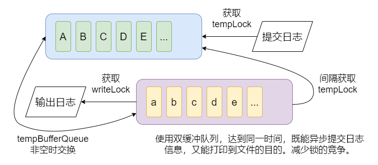

# BooAsyncLog
A C++ asynchronous logging library.

## Sample Program
```c++
#include <iostream>
#include <chrono>

#include "boo/booAsyncLog/asyncLog.h"

int main() {
    boo::asynclog::log::asyncLog alb;
    std::chrono::high_resolution_clock::time_point start, end;

    std::chrono::duration<double> elapsed{};
    std::vector<std::thread> threads;

    start = std::chrono::high_resolution_clock::now();

    for (int i = 0; i < 1000000; ++i) {
        alb.pushSync(
                "123456789012345678901234567890123456789012345678901234567890123456789012345678901234567890123456789\n",
                100);
    }

    end = std::chrono::high_resolution_clock::now();
    elapsed = end - start;
    std::cout << "同步输出100w条（100B/条）日志时间: " << elapsed.count() << " seconds" << std::endl;

    start = std::chrono::high_resolution_clock::now();


    for (int i = 0; i < 1000000; ++i) {
        alb.push(
                "123456789012345678901234567890123456789012345678901234567890123456789012345678901234567890123456789\n",
                100);
    }

    end = std::chrono::high_resolution_clock::now();
    elapsed = end - start;
    std::cout << "异步输出100w条（100B/条）日志时间: " << elapsed.count() << " seconds" << std::endl;
}
```
### Result
同步输出100w条（100B/条）日志时间: 2.66441 seconds<br>
异步输出100w条（100B/条）日志时间: 0.0692614 seconds<br>
<br>
Time to output 1 million logs synchronously (100B/log): 2.66441 seconds(37w/s)<br>
Time to output 1 million logs asynchronously (100B/log): 0.0692614 seconds(1443w/s)
<br>
Of course, if the output is added with time, the asynchronous library will run slowly, so I suggest using the file name to check the date.
Currently only supports Windows, and may be updated in the future.

## Main acceleration methods
<br>
A double buffer queue is used to achieve asynchronous submission and writing. The producer can easily obtain the lock of the production storage queue, and it keeps writing to the production storage queue; the consumer can easily obtain the lock of the consumption storage queue, and it keeps reading and processing the information of the consumption storage queue. Once the consumer has finished consuming, the consumer will want to obtain the lock of the producer storage queue, and then quickly (this is very important) complete an exchange process, so that for a large number of producer information, there is no need to frequently seize the lock (assuming there is only one lock and one queue). The final effect is that the thread that writes the log is in the process of writing the log, and the thread that submits the log is constantly submitting the log without waiting (to compete for the lock). When the queue for storing the immediate log is empty, a lock preemption will occur, but this process is very fast because the two queues are directly exchanged. I think I am a bit wordy.<br>
I printed the size of each exchange (asynchronous writing of 1 million logs), and the results were: 1, 1, 1, 14, 11, 29, 52, 188, 358, 844, 1859, 3353, 6052, 10515, 1721.<br>
This shows that the code has achieved the desired effect, but I think it would be better if the result was not steep at the highest point but smooth, that is, if I controlled the maximum length of the queue. However, the size of this size should be debatable, and it is not intuitive to obtain this value.<br>
